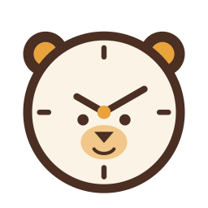

# Teddoro

A friendly Pomodoro timer with a teddy-bear clock. Flutter, iOS + Android,
fully offline — everything stays on the device.

<p align="center"></p>

## Features

| Area | What's in |
|------|-----------|
| Timer | Work / short / long break with configurable lengths, long break every N, start · pause · skip · reset, auto-start toggles, alarm with 3 sounds + volume, keep-screen-awake, persistent countdown notification, confirm-before-quit, editable focus message, absolute-time engine that survives backgrounding and force-quit |
| Tasks | Estimated vs completed pomodoros, projects, tags, ticket reference, active task on the timer, daily goal with progress bar, reorder / edit / archive / delete, filter by project · tag · done |
| Stats | Day / week / month reports, current & best streak, per-task and per-project bars, 52-week heatmap, CSV export |
| Focus aids | Ambient loops (rain, café, white noise, ticking), strict mode, minimal full-screen mode, app-blocking hook (native side pending, see below) |
| Gamification | Streaks and six badges with a bear celebration |
| Personalisation | Colour per session type, light / dark / system, built-in + custom presets, editable break reminders |
| Platform | Android home/lock-screen widget with a live countdown; iOS Live Activity flagged in `Info.plist` (extension to be added) |

## Running it

Requires Flutter 3.47+ (Dart 3.13+).

```bash
cd app
flutter pub get
flutter run            # picks the connected device / emulator
```

Android: any device or emulator on API 24+. The first build takes a few
minutes for Gradle.

iOS: `cd ios && pod install`, then `flutter run` on a simulator or device.
Notifications need a real device to actually fire.

### Regenerating assets

The sounds and the launcher icon are generated, not checked-in binaries you
have to edit by hand:

```bash
dart run tool/gen_sounds.dart            # assets/sounds/*.wav
flutter test tool/render_icon_test.dart  # assets/icon/*.png from the Dart painter
dart run flutter_launcher_icons          # Android mipmaps + iOS AppIcon set
```

`assets/logo/teddoro.svg` is the hand-authored vector; `TeddyClockPainter`
in `lib/ui/logo/` is the same mark drawn with Flutter so the app never needs
an SVG dependency.

### Tests

```bash
flutter test               # unit (engine, stats, badges) + widget tests
flutter analyze
dart format --set-exit-if-changed lib test tool
```

## Native pieces and what is still stubbed

The Dart side is complete for every feature. Three things need platform
code beyond what Flutter can do, and the wiring for each is in place:

| Feature | Android | iOS |
|---------|---------|-----|
| Session-end alerts | `flutter_local_notifications`, exact alarms, boot receiver — **done** | Local notifications via the same plugin — **done** |
| Countdown widget | `TeddoroWidgetProvider.kt` + `res/layout/teddoro_widget.xml`, driven by `home_widget` data (`status`, `type`, `endsAt`, `remaining`) — **done** | Needs a WidgetKit extension named `TeddoroWidget` reading the same keys from the shared App Group. `NSSupportsLiveActivities` is already set. See `home_widget` docs for the extension template. **To do** |
| App blocking | `AppBlockingChannel.kt` answers the `teddoro/app_blocking` channel and currently reports unsupported. Needs an AccessibilityService; steps are in the file comment. **To do** | Needs FamilyControls / ManagedSettings entitlement and a `FamilyActivityPicker`. Not wired. **To do** |

While a platform reports blocking as unsupported the whole section is
hidden from Settings, so nothing half-works.

## Layout

```
lib/
  app/          composition root (AppDependencies) and the MaterialApp
  core/         clock, ids, formatting
  domain/       pure Dart: models, TimerEngine, stats, badges, CSV
  data/         KeyValueStore (file / memory) and JSON repositories
  services/     audio, notifications, wakelock, widgets, app blocking
  state/        ChangeNotifier controllers (settings, tasks, log, timer)
  ui/           screens and widgets, one folder per feature
tool/           asset generators
test/unit       engine + stats
test/widget     timer screen end-to-end through the real controllers
```

See [ARCHITECTURE.md](ARCHITECTURE.md) for the state model, timer engine
and storage design.
